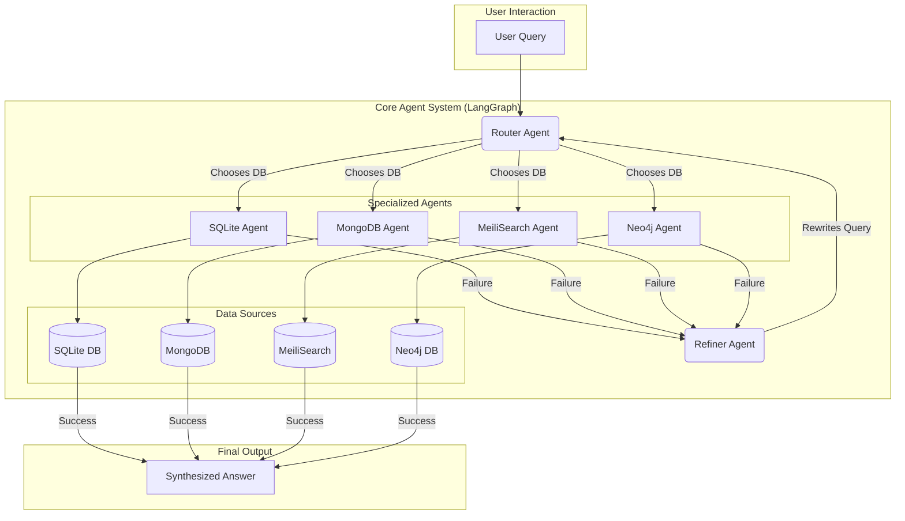

# A Multi-Agent System for Unified Database Querying

[](https://www.python.org/downloads/)
[](https://www.langchain.com/)
[](https://github.com/langchain-ai/langgraph)
[](https://streamlit.io/)
[](https://opensource.org/licenses/MIT)

This project is an advanced, multi-agent Retrieval-Augmented Generation (RAG) system designed for real-world applications. It's built to be flexible and scalable, enabling users to ask complex questions in natural language and receive answers synthesized from diverse databases: **SQLite, MongoDB, MeiliSearch, and Neo4j**.

The core architecture is a practical implementation inspired by the concepts presented in the research paper: **["A Collaborative Multi-Agent Approach to Retrieval-Augmented Generation Across Diverse Data."](https://arxiv.org/abs/2412.05838)**

---

## 🏛️ Architecture Overview

## 📂 Project Structure

The project is organized into several key directories, each responsible for a specific part of the functionality.

/
├── agents/             # Contains the core logic for each agent (Router, Refiner, etc.).
│   ├── router.py
│   └── ...
├── database/           # Scripts for creating and populating the databases.
│   └── populate_db.py
├── graph/              # Defines the structure and flow of the agentic graph.
│   └── builder.py
├── tools/              # Contains tools for database-specific query generation.
│   └── db_tools.py
├── ui/                 # The Streamlit user interface code.
│   └── app_ui.py
├── .env.example        # Example environment variables file.
├── app.py              # Main entry point for the command-line application.
└── requirements.txt    # Project dependencies.


The system leverages `LangGraph` to create a stateful, cyclical graph of agents that work collaboratively to answer queries.

1.  **Router Agent**: First, a router agent analyzes the user's question to determine the most appropriate database (or databases) to query.
2.  **Specialized Agents**: The query is then passed to one or more specialized agents, each an expert in generating queries for a specific database (SQL, Cypher, etc.).
3.  **Query Execution**: The generated query is executed against the corresponding database.
4.  **Answer Synthesis**: The results are synthesized into a coherent, human-readable answer.
5.  **Self-Correction Loop**: If a query fails or returns no results, a **Refiner Agent** attempts to rewrite the query and retry the process, creating a self-correcting loop.
6.  **Clarification Questions**: If the initial question is ambiguous, the system can ask the user for clarification before proceeding.


## ✨ Key Features

* **Multi-Database Support**: Simultaneously query relational, document, search, and graph databases.
* **Intelligent Routing**: Automatically selects the best data source for a given question.
* **Self-Correcting Agents**: Agents can refine and correct their own queries upon failure.
* **Interactive UI**: A user-friendly interface built with Streamlit to visualize the process.
* **Modular Design**: Easily extendable to include new agents and data sources.

## 🛠️ Technologies Used

* **Orchestration**: LangChain & LangGraph
* **LLMs**: OpenAI
* **Databases**:
    * Relational: SQLite
    * Document: MongoDB
    * Search: MeiliSearch
    * Graph: Neo4j
* **UI**: Streamlit
* **Environment Management**: python-dotenv

## 🚀 Getting Started

### 1. Prerequisites

* Python 3.9 or higher
* An OpenAI API Key | I recommend TogeterAPIs

### 2. Installation

Clone the repository and install the required dependencies.

```bash
git clone https://github.com/hamed-nhi/Multi-Agent-RAG.git
cd Multi-Agent-RAG
pip install -r requirements.txt
```

### 3. Environment Setup

Create a `.env` file in the root directory by copying the example file:

```bash
cp .env.example .env
```

Now, open the `.env` file and add your OpenAI API key:

```
OPENAI_API_KEY="sk-..."
```

### 4. Populate Databases

Run the `populate_db.py` script to create and fill the databases with sample data.

```bash
python -m database.populate_db
```

### 5. Usage

You can interact with the system in two ways:

**A) Interactive Streamlit UI (Recommended)**

Launch the Streamlit application:

```bash
streamlit run ui/app_ui.py
```

Open your browser to the local URL provided to start asking questions.

**B) Command-Line Interface (CLI)**

Run the main application script:

```bash
python app.py
```

You will be prompted to enter your questions in the terminal.

---

## 🙏 Acknowledgements

The architecture and core concepts of this project are heavily inspired by the insightful work presented in the following research paper:

* **Title**: A Collaborative Multi-Agent Approach to Retrieval-Augmented Generation Across Diverse Data
* **Authors**: Aniruddha Salve, Saba Attar, Mahesh Deshmukh, Sayali Shivpuje, Arnab Mitra Utsab
* **Link**: [arXiv:2412.05838](https://arxiv.org/abs/2412.05838)

## 🤝 Contributing

Contributions are welcome! If you have ideas for new features or improvements, please open an issue or submit a pull request.

## 📄 License

This project is licensed under the MIT License. See the [LICENSE](LICENSE) file for details.
